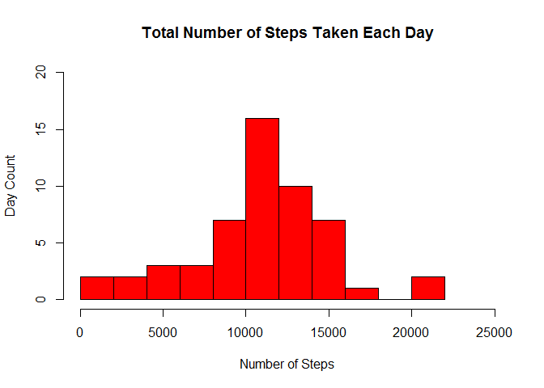
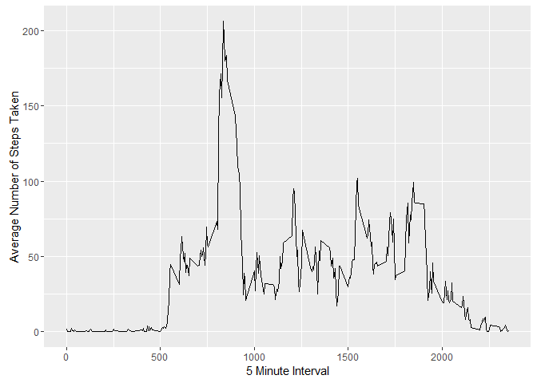
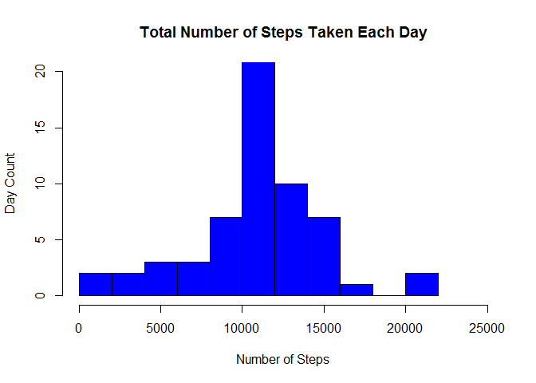
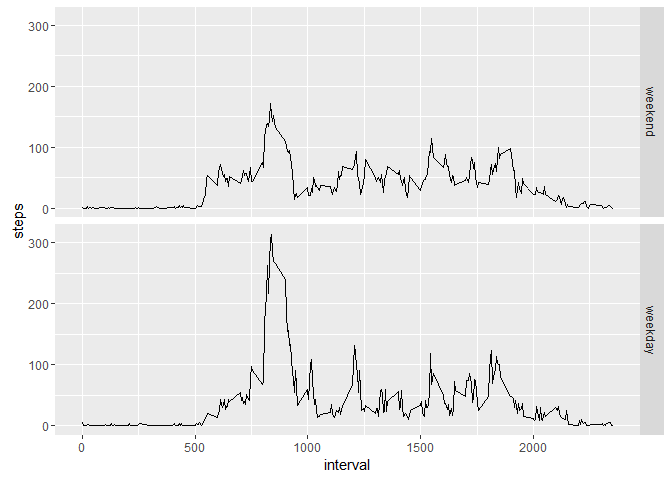

# Reproducible Research: Peer Assessment 1

Write a report that provides the answers to the questions enumerated below

1.  Code for reading in the dataset and/or processing the data

```r
data <- read.csv("activity.csv")
```

2. Histogram of the total number of steps taken each day

```r
hist1<-as.data.frame(tapply(data$steps,data$date, sum))
names(hist1)<- c("steps")
```


```r
hist(hist1$steps, breaks = 10, col = "red", 
  xlab = "Number of Steps", ylab = "Day Count",
  main = "Total Number of Steps Taken Each Day",
  xlim=c(0,25000),  ylim=c(0,20))
```

\

3. Mean and median number of steps taken each day  

```r
data.mean<-mean(hist1$steps,na.rm=TRUE)
data.mean
```

```
## [1] 10766.19
```


```r
data.median<-median(hist1$steps, na.rm = TRUE)
data.median
```

```
## [1] 10765
```

4. Time series plot of the average number of steps taken

```r
timeseries1 <- aggregate(data$steps ~ data$interval, FUN = mean, na.rm = TRUE)
names(timeseries1)<-c("interval","steps")

library(ggplot2)
```

```
## Warning: package 'ggplot2' was built under R version 3.2.5
```

```r
ggplot(timeseries1, aes(x=interval, y=steps)) +
    geom_line()+
        xlab("5 Minute Interval") +
        ylab("Average Number of Steps Taken")
```

\

5. The 5-minute interval that, on average, contains the maximum number of steps

```r
timeseries1[which.max(timeseries1$steps),]
```

```
##     interval    steps
## 104      835 206.1698
```

6. Code to describe and show a strategy for imputing missing data

Calculate and report the total number of missing values in the dataset 

```r
sum(is.na(data$steps))
```

```
## [1] 2304
```

Replace each missing value with the mean value of its 5-minute interval

```r
fill.value <- function(steps, interval) {
    filled <- NA
    if (!is.na(steps))
        filled <- steps
    else
        filled <- (timeseries1[timeseries1$interval==interval, "steps"])
    return(filled)
}
filled.data <- data
filled.data$steps <- mapply(fill.value, filled.data$steps, filled.data$interval)
```

7. Make a histogram of the total number of steps taken each day and Calculate and report the mean and median total number of steps taken per day. Do these values differ from the estimates from the first part of the assignment? What is the impact of imputing missing data on the estimates of the total daily number of steps

```r
hist2<-as.data.frame(tapply(filled.data$steps,filled.data$date, sum))
names(hist2)<- c("steps")

hist(hist2$steps, breaks = 10, col = "blue", 
  xlab = "Number of Steps", ylab = "Day Count",
  main = "Total Number of Steps Taken Each Day",
  xlim=c(0,25000),  ylim=c(0,20))
```

\

Mean and median number of steps taken each day  

```r
data.mean2<-mean(hist2$steps,na.rm=TRUE)
data.mean2
```

```
## [1] 10766.19
```


```r
data.median2 <- median(hist2$steps, na.rm = TRUE)
data.median2
```

```
## [1] 10766.19
```

The impact of imputing missing data with the average number of steps in the same 5-minute interval is that the number of steps taken for most intervals appears to increase

8. Are there differences in activity patterns between weekdays and weekends?

For this part the weekdays() function may be of some help here. Use the dataset with the filled-in missing values for this part.  Create a new factor variable in the dataset with two levels - "weekday" and "weekend" indicating whether a given date is a weekday or weekend day.

```r
filled.data$date <- as.Date(filled.data$date)
#create a vector of weekdays
weekdays1 <- c('Monday', 'Tuesday', 'Wednesday', 'Thursday', 'Friday')
#use `%in%` and `weekdays` to create a logical vector
#convert to `factor` and specify the `levels/labels`

filled.data$wDay <- factor((weekdays(filled.data$date) %in% weekdays1), 
         levels=c(FALSE, TRUE), labels=c('weekend', 'weekday')) 
```

9. Make a panel plot containing a time series plot (i.e. type = "l") of the 5-minute interval (x-axis) and the average number of steps taken, averaged across all weekday days or weekend days (y-axis). See the README file in the GitHub repository to see an example of what this plot should look like using simulated data.


```r
filled.data2 <- aggregate( steps ~ interval + wDay, data = filled.data, FUN = mean)
ggplot(filled.data2, aes(x=interval, y=steps)) +
    geom_line()+facet_grid(wDay~.)
```

\
